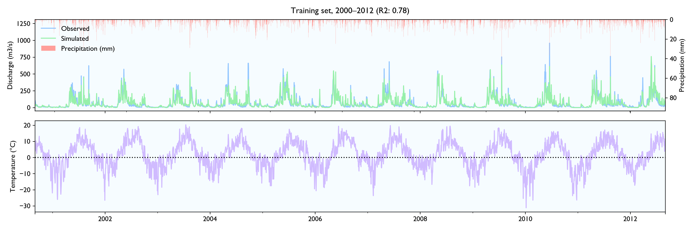
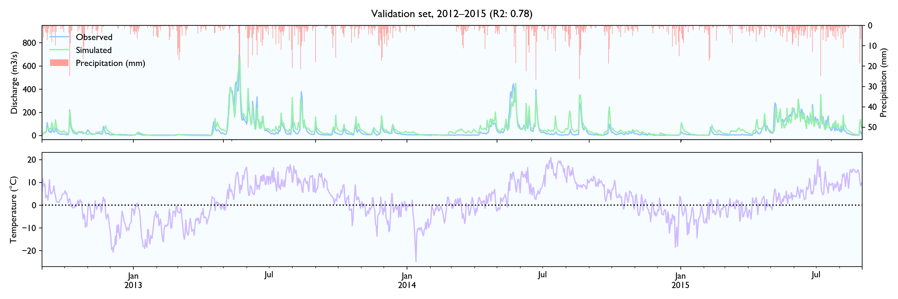
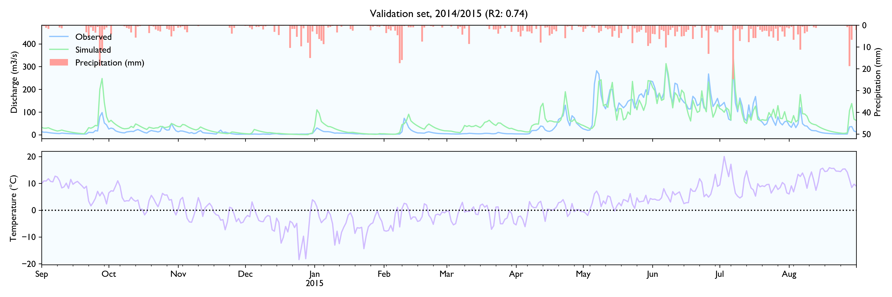

# SwiftHBV

SwiftHBV is a Swift package to run and calibrate HBV-models, a lumped hydrological model to estimate discharge in unregulated rivers. Model parameters are optimized by running **Simplex/Nelder–Mead method** multiple times. The objective function is a weighted sum of 1) **Nash Sutcliffe** (R2) on the discharge rate, and 2)  the  **absolute error** on the accumulated discharge.

Reusability
-----------

The code is written so it should be fairly easy to implement different search methods and objective functions or change the model. You are free to use it as you would like. The quality should be decently. Most of the critical functions are covered by tests and the implementation seems to work decent. However, it is a small personal project and it might contain some bugs. I would not have used it for critical applications without more extensive testing, and there are many C++ implementations with better calibration engines out there.

Motivation
----------

The motivation for the project was mainly to get a model that was fairly easy to experiment with, and that could be used as a benchmark against recurrent neural network models. (See [test of LSTM on the same dataset](https://nbviewer.jupyter.org/github/jontingvold/datascience-projects/blob/master/Hydrological%20modeling%20with%20a%20simple%20LSTM%20network%20of%2030%20units/Hydrological%20modeling%20with%20a%20simple%20LSTM%20network%20of%2030%20units.ipynb).) 

Calibration speed
-----------------

Swift was chosen to improve speed. Swift is almost as fast as C/C++, but as a modern language is easier to read and less prone to bugs. 

The calibration is quite fast and can evaluate ca. 1000 different solutions of a 12-year dataset of daily values in about 5 seconds on a normal laptop (or 1 min for 10 years of hourly values). That is usually enough for the Simplex algorithm to converge.

Calibration search
------------------

The Nelder–Mead method (also called Simplex, but not the same Simplex algorithm that is used in linear programming) is used to calibrate parameters. It is a hill-climbing algorithm for non-differentiable optimization problems that adjust the step size dynamically. In my implementation, the search is terminated when the improvement in the last 300 solutions is less than 0.1%, and the standard error of solutions in the current simplex is less than 0.1%.

The convergence with pure Nelder–Mead is not perfect. At least in the included dataset, it seems to converge to non-optimal solutions about 1/4 of the time. To avoid these problems it shakes up the solutions by adding noise every 80 iterations. 20% in the beginning and then gradually less. It also runs the whole process multiple times and selects the best solution.

It is hard to know for sure if it finds the optimal solution. But it usually finds many different solutions with ca. the same objective/cost score, so that should be a pretty good sign.

If I had implemented it today, I would probably have selected a more explorative search algorithm less prone to be stuck in local minimas, something like particle swarm optimization. That would also make it parallelizable, which Nelder–Mead is not.

#### Back-propagation?

It should also be possible to implement back-propagation and use gradient descent, like neural networks, to make calibration faster. As far as I can tell it seems like the HBV-model is differentiable. I have not seen any Tensorflow/Theano implementations of HBV, but the only strictly non-differentiable functions in HBV is min/max and these are as good as differentiable in practice. 

Gradient descent would, however, not solve the problems of local minimas. Neural networks do normally not suffer from local minimas because they usually have lots of parameters. The situation where all second derivates are positive is therefore rare. HBV contains only 16 parameters, so local minimas are much more likely. Some exploration/jumps would therefore still be required. 

Model performance
-----------

I had a hard time finding hydrological time series to test the data, so the model is not tested extensively. NVE does not release hydrological data for free. The only data series I could find was a 15-year series of daily values from Hagabru, a discharge station in the Gaula river system, south of Trondheim (Norway). This is a big catchment (3059,5 km2) with no lakes to dampen responses.

For this dataset, the model seems to work well. The calibrated model has a Nash-Sutcliffe efficiency/R2 of 0.79 on the 12-year training set and 0.80 on the 3-year validation set (where 0.0 is the trivial mean prediction and 1.0 is perfect prediction). In the validation set, the water balance is good the first year but is consistently 20% too high in the last two years. This is as far as I know considered decent in hydrology.

Although the calibration gives decent fit and god predictions on the validation set, the converged solutions vary widely and are often way past reasonable values. This is worrisome, although arguably might not matter much as long as predictions are good. 

It is hard to know for sure why the space of decent parameters are so huge, but it is probably at least to some extent because of unstable parameters and a too-small dataset. HBV contains many heavily dependent parameters like `pcorr` and `epot`. This makes these parameters inherently unstable and hard to estimate. These problems might go away with a bigger dataset.

#### Training set (2000–2012)




#### Validation set (2013–2015)







Installation
------------

Add `.package(url: "https://github.com/jontingvold/SwiftHBV.git", from: "0.1.0")` to your `Package.swift` file's `dependencies`.

Usage
-----

```swift
import SwiftHBV

let swiftHBV = SwiftHBV(
    trainingsetFilepath: trainingsetFilepath,
    validationsetFilepath: validationsetFilepath,
    catchmentParamsYamlFilepath: catchmentParamsYamlFilepath
)!

swiftHBV.optimize(
  runs: 20, 
  maxIterationsEachRun: 2000, 
  shouldPrintFeedback: true, 
  printFeedbackInterval: 50
)

// PRINT RESULTS

print(swiftHBV.getResults())

// GET SIMULATED DATA/DISCHARGE

swiftHBV.getSimulationData()

// returns an array of SimulatedCatchmentTimestep-tuples:
// (datetime: String, percepation_mm_per_timestep: Double, temp: Double, Q_observed: Double, Q_simulated: Double)

// SAVE RESULTS AS CSV-files

swiftHBV.saveResults(filepath: resultsFilepath)
swiftHBV.saveSimulationData(filepath: trainingsetSimDataFilepath, dataset: .Trainingset)
swiftHBV.saveSimulationData(filepath: validationsetSimDataFilepath, dataset: .Validationset)

```

Or check out [Sources/SwiftHBV-example/main.swift](Sources/SwiftHBV-example/main.swift) 

Questions?
----------

Feel free to [send me an email](http://www.jontingvold.no/) if you have questions about the project.

## License

[MIT](LICENSE.txt)